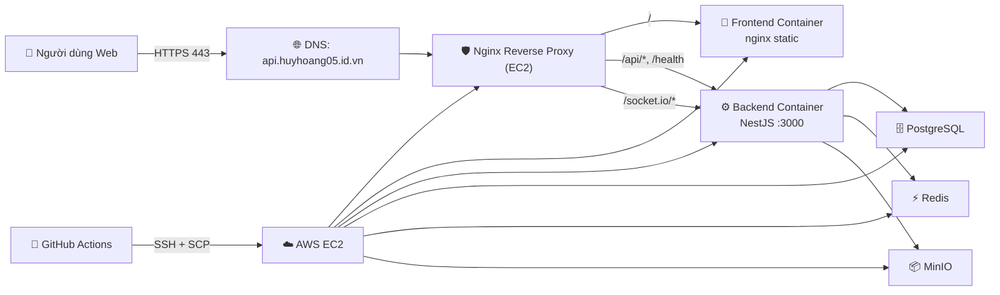
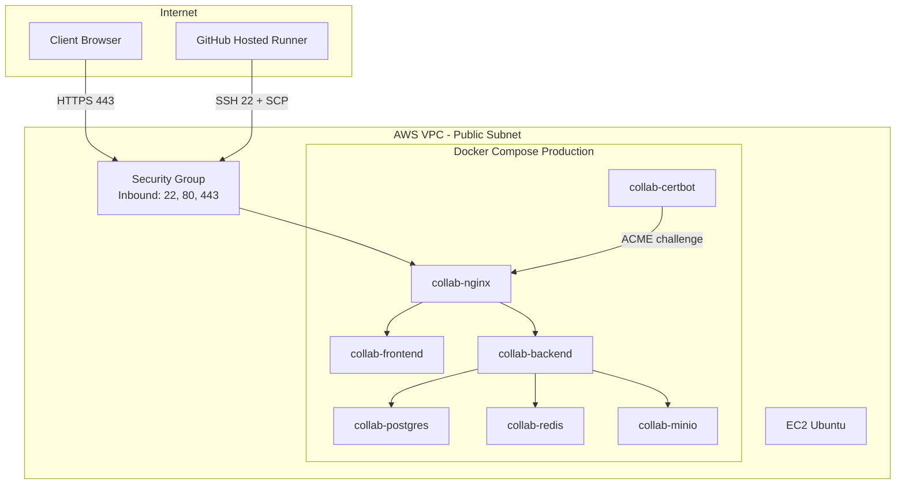
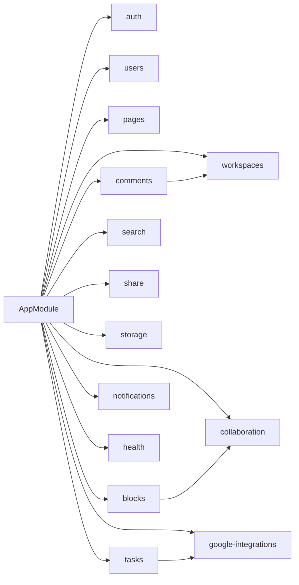
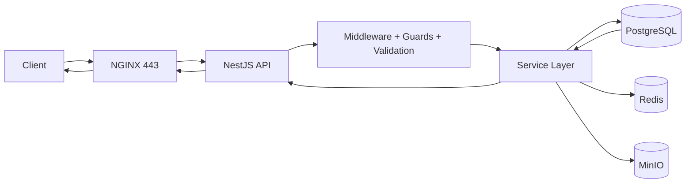
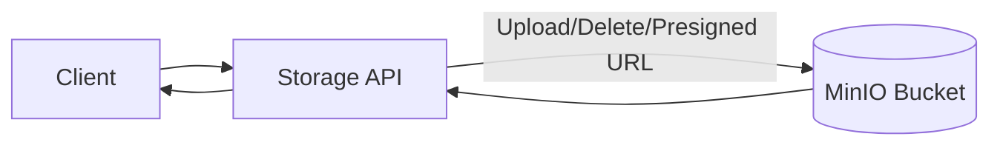
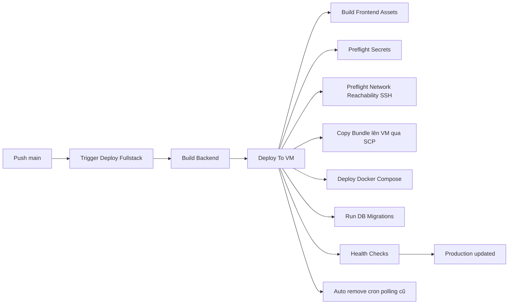
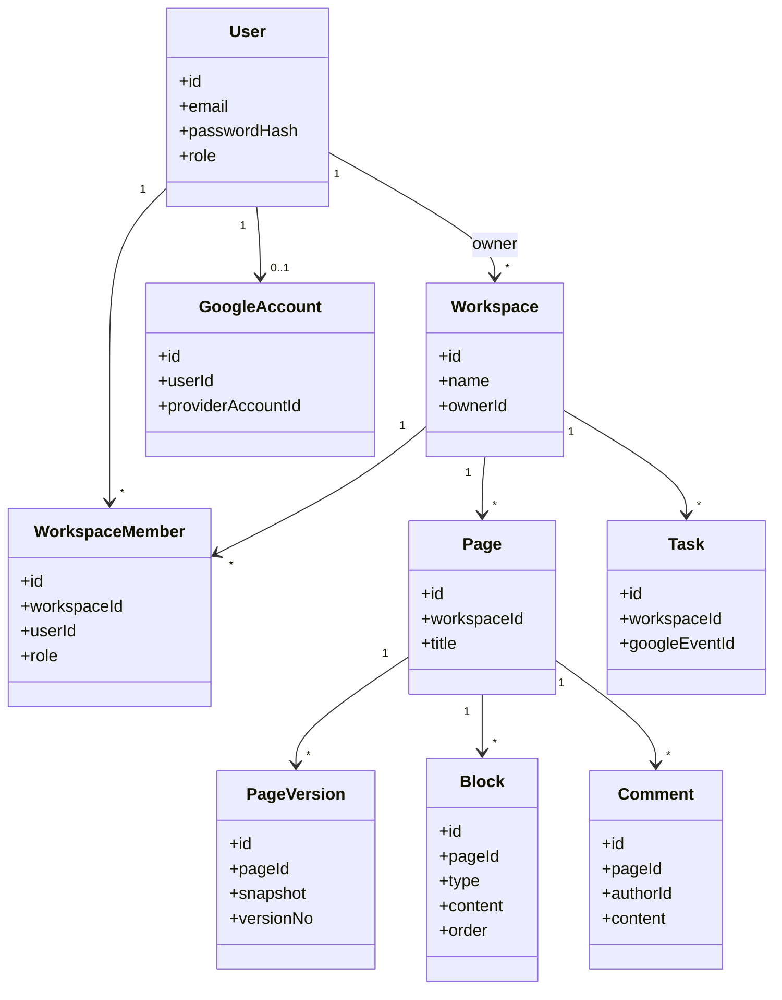

# Hồ Sơ Kỹ Thuật Đồ Án Cloud

Tài liệu này là bản tổng hợp 1-file để chuẩn bị vấn đáp, thuyết trình và bàn giao kỹ thuật cho đồ án Collaborative Workspace Platform.

Cập nhật: 2026-04-11

## 1. Tổng quan đồ án

### 1.1 Bài toán

Đồ án xây dựng một nền tảng cộng tác kiểu Notion-lite, tập trung vào:

- Quản lý workspace, thành viên, phân quyền.
- Soạn thảo theo block/page có phiên bản.
- Bình luận và cộng tác thời gian thực (real-time).
- Tìm kiếm nội dung và chia sẻ trang.
- Tích hợp lưu trữ tệp và đồng bộ lịch Google (mức nền tảng).

### 1.2 Mục tiêu kỹ thuật của đồ án Cloud Computing

- Triển khai fullstack thực tế trên cloud.
- Vận hành bằng container để đồng nhất môi trường.
- Tự động hóa CI/CD theo mô hình push main -> tự deploy production.
- Có kiểm soát bảo mật mạng, secrets, HTTPS và health check.

### 1.3 Công nghệ chính

- Backend: NestJS, TypeScript, TypeORM.
- Frontend: React + Vite.
- Realtime: Socket.IO.
- Data: PostgreSQL, Redis, MinIO.
- Reverse proxy/TLS: Nginx + Certbot.
- CI/CD: GitHub Actions.
- Cloud runtime: AWS EC2 (IaaS).

## 2. Cloud Computing được dùng ở đâu và như thế nào

### 2.1 IaaS (Infrastructure as a Service)

- AWS EC2 chạy toàn bộ stack production.
- Security Group kiểm soát inbound 22/80/443.
- EBS cung cấp lưu trữ bền vững cho dữ liệu container.

### 2.2 SaaS cho vòng đời phát triển

- GitHub Actions làm dịch vụ CI/CD.
- GitHub Secrets lưu và cấp secrets cho pipeline deploy.

### 2.3 Cloud-native ở mức nào

Hiện tại hệ thống đang theo hướng containerized self-managed services trên 1 VM:

- PostgreSQL, Redis, MinIO chạy dạng container trong EC2.
- Chưa dùng dịch vụ managed tương ứng như RDS, ElastiCache, S3.

Ý nghĩa cho môn Cloud:

- Đã thể hiện đầy đủ luồng triển khai ứng dụng lên cloud và vận hành thật.
- Thể hiện rõ bài toán đánh đổi giữa self-managed và managed services.

## 3. Kiến trúc hệ thống tổng thể



## 4. Sơ đồ hạ tầng triển khai (deployment topology)



## 5. Cấu trúc backend theo module

Các module nghiệp vụ hiện có trong backend:

- auth
- users
- workspaces
- pages
- blocks
- comments
- collaboration
- search
- share
- storage
- tasks
- notifications
- google-integrations
- health



## 6. Luồng xử lý chính của hệ thống

### 6.1 Luồng request API tiêu chuẩn



### 6.2 Luồng cộng tác realtime (không dùng sequence)

```mermaid
flowchart TB
		U1[Editor A] -->|REST cập nhật block| API[NestJS BlocksService]
		API --> DB[(PostgreSQL)]
		API --> EV[CollaborationEventsService]
		EV --> GW[Socket Gateway]
		GW -->|Broadcast room page:{id}| U2[Viewer/Editor B]
		GW -->|Broadcast room page:{id}| U3[Editor C]
```

### 6.3 Luồng upload tệp



## 7. Sơ đồ pipeline CI/CD production



Ý nghĩa chuyên nghiệp của pipeline:

- Có preflight để fail sớm, lỗi rõ nguyên nhân.
- Có migration + health check sau deploy.
- Có cơ chế loại bỏ fallback cũ để chuẩn hóa một luồng deploy duy nhất.

## 8. Sơ đồ dữ liệu mức khái niệm (ERD rút gọn)



## 9. Liên kết giữa các lớp hạ tầng và ứng dụng

1. DNS trỏ về IP public của EC2.
2. Security Group cho phép web traffic (80/443) vào Nginx.
3. Nginx phân tuyến request tới frontend/backend/socket.
4. Backend truy cập data services trong Docker network nội bộ.
5. GitHub Actions dùng SSH để copy source/bundle và chạy deploy script trên VM.

Điểm mấu chốt cho vấn đáp Cloud:

- Lớp network policy quyết định CI/CD có deploy được hay không.
- Lớp application chỉ thành công khi infrastructure mở đúng đường đi.

## 10. Bảo mật và vận hành

### 10.1 Bảo mật đang có

- JWT access + refresh token.
- Guard/role-based authorization ở backend.
- HTTPS termination tại Nginx.
- Secrets tách khỏi source code qua GitHub Secrets.
- Security Group kiểm soát cổng vào.

### 10.2 Vận hành và kiểm tra sức khỏe

- Endpoint health: /health.
- Docker healthcheck cho backend/postgres.
- Post-deploy smoke: /, /health, /privacy-policy, /terms.

### 10.3 Rủi ro hiện tại

- Single-VM architecture là single point of failure.
- Dịch vụ dữ liệu self-managed tăng chi phí vận hành.
- SSH inbound policy chưa tối ưu cho GitHub-hosted runner.

## 11. Trạng thái thực tế hiện tại của CI/CD

- CI: đã tự động chạy khi push main.
- CD: chưa hoàn tất end-to-end ở lần gần nhất do fail bước preflight network reachability (runner không vào được SSH host:port).

Kết luận chính xác:

- Mô hình tự động đã có và hoạt động đến mức build + validate.
- Để chốt auto deploy production hoàn toàn, cần thông đường SSH từ GitHub runner tới VM (security group/firewall/port/host secrets).

## 12. Lộ trình nâng cấp cloud-native sau vấn đáp

1. Chuyển PostgreSQL sang Amazon RDS.
2. Chuyển MinIO sang Amazon S3.
3. Chuyển Redis sang ElastiCache.
4. Tách compute sang ECS/EKS hoặc mô hình 2+ VM sau load balancer.
5. Bổ sung quan trắc tập trung: CloudWatch logs/metrics/alerts.
6. Hardening bảo mật: giới hạn SSH bằng runner strategy phù hợp, hoặc chuyển sang pull-based deploy agent.

## 13. Gợi ý dàn ý thuyết trình 7-10 phút

1. Bài toán và mục tiêu Cloud của đồ án.
2. Kiến trúc tổng thể và deployment topology.
3. Luồng nghiệp vụ runtime: API + realtime + storage.
4. Pipeline CI/CD và cơ chế kiểm soát rủi ro khi deploy.
5. Trạng thái hiện tại, nút thắt, và kế hoạch nâng cấp cloud-native.

## 14. Điểm nhấn trả lời vấn đáp (ngắn gọn)

- Cloud nằm ở cả hạ tầng chạy hệ thống (IaaS) và dịch vụ tự động hóa vòng đời phần mềm (SaaS CI/CD).
- Kiến trúc hiện tại tối ưu cho giai đoạn demo và học thuật: triển khai được, quan sát được, sửa lỗi nhanh.
- Bài học quan trọng: Deploy tự động phụ thuộc đồng thời vào code + pipeline + network policy + secrets.
- Hệ thống đã sẵn đường nâng cấp lên mô hình managed/cloud-native khi tăng quy mô.
