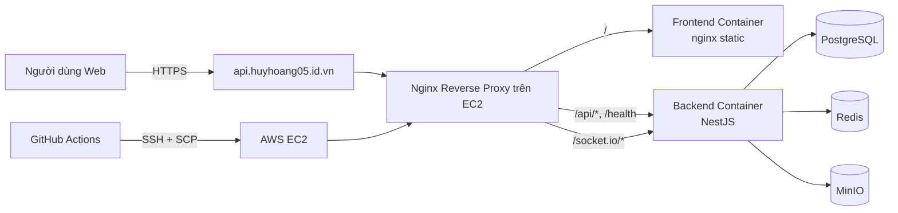
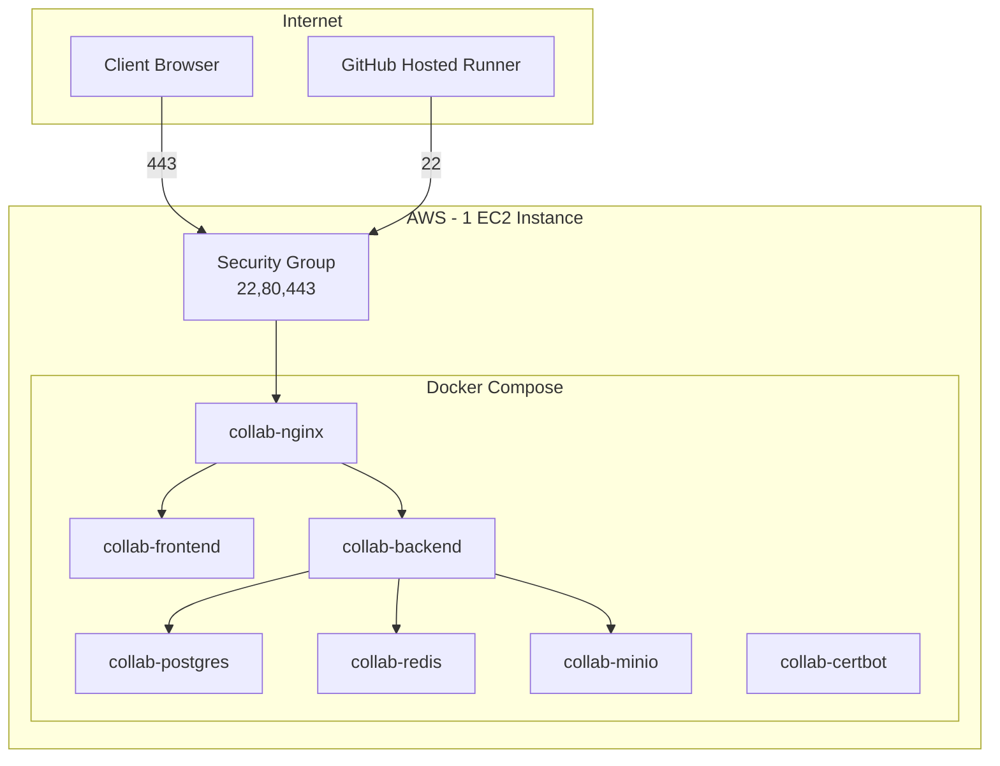

# Kiến Trúc Cloud Và Hạ Tầng Hệ Thống

## 1. Cloud được sử dụng ở đâu

### 1.1 Hạ tầng (IaaS)

- AWS EC2: chạy toàn bộ dịch vụ production.
- AWS Security Group: kiểm soát truy cập mạng 22/80/443.
- EBS: lưu trữ persistent volume cho container data.

### 1.2 Dịch vụ DevOps (SaaS)

- GitHub Actions: build, deploy tự động.
- GitHub Secrets: quản lý thông tin nhạy cảm cho pipeline.

## 2. Kiến trúc tổng thể

## 3. Topology triển khai production

## 4. Bản đồ route ở tầng reverse proxy

- `/` -> frontend container.
- `/api/*` -> backend container.
- `/health` -> backend health endpoint.
- `/socket.io/*` -> backend websocket transport.

## 5. Liên kết giữa các lớp

1. Lớp truy cập internet đi qua Nginx.
2. Lớp ứng dụng xử lý nghiệp vụ ở backend.
3. Lớp dữ liệu lưu trong Postgres/Redis/MinIO.
4. Lớp vận hành dùng GitHub Actions tác động lên EC2 qua SSH.

## 6. Điểm mạnh kiến trúc hiện tại

- Đơn giản, dễ triển khai, phù hợp phạm vi đồ án.
- Đồng nhất môi trường nhờ container.
- Dễ trình bày luồng cloud end-to-end trong vấn đáp.

## 7. Giới hạn hiện tại

- Single instance nên chưa có tính sẵn sàng cao.
- Dịch vụ dữ liệu self-managed tăng tải vận hành.
- CI/CD phụ thuộc khả năng SSH từ runner tới VM.

## 8. Hướng nâng cấp cloud-native

- Postgres -> Amazon RDS.
- Redis -> ElastiCache.
- MinIO -> S3.
- Bổ sung load balancer + đa instance backend.
- Tích hợp monitoring/alerting tập trung.
