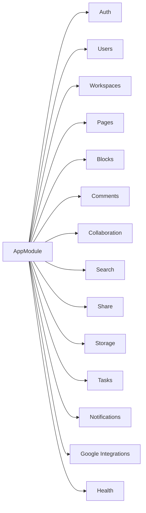
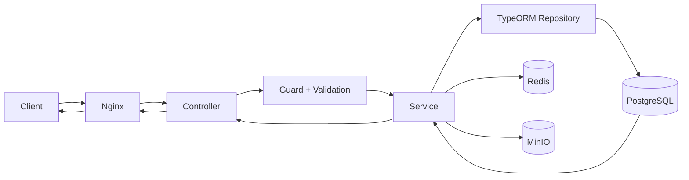
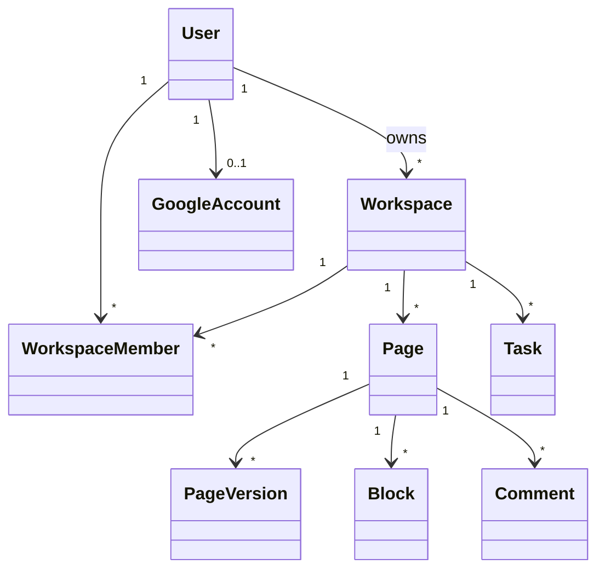

# Thiết Kế Kỹ Thuật Backend, Frontend Và Dữ Liệu

## 1. Kiến trúc backend theo module

Các module chính:

- auth
- users
- workspaces
- pages
- blocks
- comments
- collaboration
- search
- share
- storage
- tasks
- notifications
- google-integrations
- health



## 2. Luồng xử lý API



## 3. Luồng realtime cộng tác

```mermaid
flowchart TB
    A[Editor A] -->|Cập nhật block| API[BlocksService]
    API --> DB[(PostgreSQL)]
    API --> EventBus[CollaborationEventsService]
    EventBus --> Gateway[Socket Gateway]
    Gateway -->|Broadcast room page:{id}| B[Editor B]
    Gateway -->|Broadcast room page:{id}| C[Viewer C]
```

## 4. Thiết kế frontend

- Frontend sử dụng React + Vite.
- App routing theo các nhóm màn hình:
  - Public pages.
  - Auth pages.
  - Workspace/page editor.
  - Legal pages.
- Giao tiếp backend bằng API base URL cấu hình theo môi trường build.

## 5. Thiết kế dữ liệu mức khái niệm



## 6. Bảo mật ứng dụng

- JWT access/refresh token.
- Guard kiểm soát truy cập theo vai trò.
- Hash mật khẩu bằng bcrypt.
- Throttle endpoint nhạy cảm.
- Secrets không hard-code trong source.

## 7. Khả năng mở rộng kỹ thuật

- Có thể tách backend thành nhiều service theo domain.
- Có thể đưa realtime sang Redis adapter khi scale ngang.
- Có thể chuyển lớp storage sang managed services khi cần.
