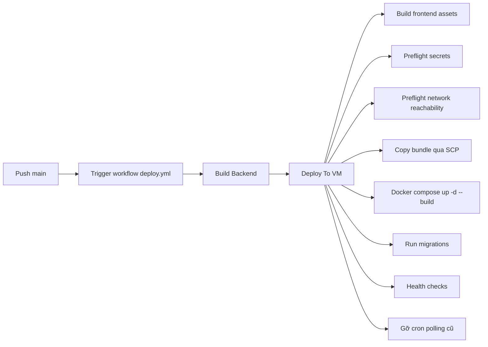

# Triển Khai, Vận Hành, CI/CD Và Kế Hoạch Mở Rộng

## 1. Môi trường triển khai

- Local dev: Docker Compose local (Postgres, Redis, MinIO).
- Production: AWS EC2 + Docker Compose production.
- Domain public: `api.huyhoang05.id.vn`.

## 2. Pipeline CI/CD hiện tại

## 3. Checklist vận hành production

- Kiểm tra DNS trỏ đúng IP production.
- Kiểm tra Security Group mở đúng cổng 22/80/443.
- Kiểm tra backend `.env` trên VM đầy đủ.
- Kiểm tra secrets GitHub `PROD_*` đầy đủ.
- Kiểm tra endpoint health sau deploy.

## 4. Có thể stop instance rồi mở lại không?

Có. Có thể stop EC2 khi không dùng để tiết kiệm chi phí, sau đó start lại khi cần.

Điều kiện để chạy lại ổn định:

1. Dùng EBS volume để dữ liệu không mất sau stop/start.
2. Giữ nguyên hoặc cập nhật DNS nếu public IP thay đổi.
3. Docker service khởi động bình thường khi VM lên lại.
4. Container có `restart: unless-stopped` sẽ tự chạy lại nếu trước đó không bị stop thủ công.

## 5. Quy trình khởi động lại sau khi start instance

1. Kiểm tra SSH vào VM.
2. Kiểm tra container trạng thái:
   - `docker compose -f docker-compose.prod.yml ps`
3. Nếu thiếu service, chạy:
   - `docker compose -f docker-compose.prod.yml up -d --build --remove-orphans`
4. Kiểm tra endpoint:
   - `/`
   - `/health`
   - `/privacy-policy`
   - `/terms`

## 6. Rủi ro vận hành và cách giảm thiểu

- Rủi ro SSH từ GitHub runner bị chặn.
  - Giảm thiểu: cấu hình Security Group phù hợp, xác nhận `PROD_SSH_HOST/PORT`.
- Rủi ro single point of failure.
  - Giảm thiểu: backup định kỳ, snapshot EBS, kế hoạch failover.
- Rủi ro sai lệch cấu hình môi trường.
  - Giảm thiểu: chuẩn hóa secrets và runbook.

## 7. Đề xuất mở rộng sau demo

- Chuyển DB/cache/storage sang managed services.
- Thêm giám sát tập trung và cảnh báo.
- Cứng hóa bảo mật mạng và IAM.
- Từng bước chuyển từ single-instance sang high-availability.
